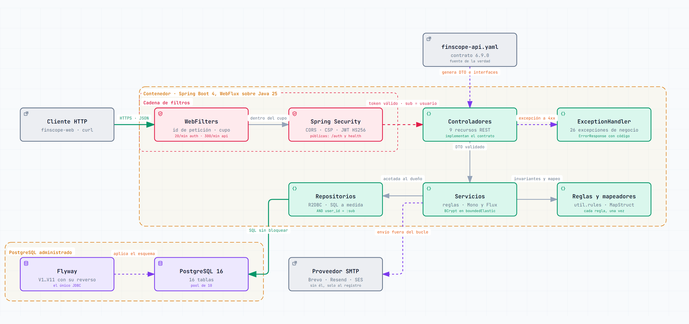

<div align="center">

# FinScope API

**API reactiva de finanzas personales.** Registra en qué se va el dinero, lo reparte por
categorías y tags, lo compara con un presupuesto mensual y lleva la cuenta de los movimientos
que se repiten.

[](https://openjdk.org/)
[](https://spring.io/projects/spring-boot)
[](https://docs.spring.io/spring-framework/reference/web/webflux.html)
[](https://www.postgresql.org/)
[](https://r2dbc.io/)
[](src/main/resources/openapi/finscope-api.yaml)
[](#pruebas-y-ci)

[Arquitectura](#arquitectura) · [La API](#la-api) · [Arrancar](#arrancar) ·
[Variables](#variables-de-entorno) · [Despliegue](#despliegue) ·
[Frontend](https://github.com/sebastian-reyes/finscope-web)

</div>

---

## Tabla de contenido

- [Qué es esto](#qué-es-esto)
- [Arquitectura](#arquitectura)
- [El dominio en cinco piezas](#el-dominio-en-cinco-piezas)
- [La API](#la-api)
  - [Autenticación y cuenta](#autenticación-y-cuenta)
  - [Catálogos](#catálogos)
  - [Movimientos](#movimientos)
  - [Resúmenes](#resúmenes)
  - [Presupuestos](#presupuestos)
  - [Movimientos fijos](#movimientos-fijos)
  - [Avisos al teléfono](#avisos-al-teléfono)
  - [Errores](#errores)
- [Seguridad](#seguridad)
- [El modelo de datos](#el-modelo-de-datos)
- [Estructura del proyecto](#estructura-del-proyecto)
- [Arrancar](#arrancar)
- [Variables de entorno](#variables-de-entorno)
- [Pruebas y CI](#pruebas-y-ci)
- [Despliegue](#despliegue)
- [Cómo cambiar algo](#cómo-cambiar-algo)

---

## Qué es esto

El backend de [FinScope](https://fin-scope.app), una aplicación de finanzas personales. Es una
API REST sin estado: los clientes se identifican con un token firmado y **todo dato privado se
consulta acotado a su dueño**, con el identificador sacado del token y nunca de la petición.

Tres decisiones explican casi todo lo demás:

| | |
| --- | --- |
| **Reactiva de arriba abajo** | WebFlux y R2DBC en lugar del MVC de siempre y JDBC: ninguna petición bloquea un hilo esperando a la base de datos. Lo que sí bloquea por diseño —BCrypt y el envío de correo— sale del bucle de eventos a `Schedulers.boundedElastic()`. |
| **El contrato manda** | [`finscope-api.yaml`](src/main/resources/openapi/finscope-api.yaml) no documenta la API: **la define**. El generador rehace los DTO y las interfaces de los controladores en cada compilación, así que una respuesta que se aparte del contrato no llega a compilar. |
| **Lo que se puede calcular no se guarda** | Lo gastado de un presupuesto y el estado mensual de un movimiento fijo salen de los hechos, no de una columna que alguien tenga que mantener al día. Sin segunda verdad, no hay nada que desincronizar. |

---

## Arquitectura

### El sistema completo

Dos piezas que se despliegan por separado: esta API y una
[aplicación web instalable](https://github.com/sebastian-reyes/finscope-web).

<picture>
  <source media="(prefers-color-scheme: dark)" srcset="docs/architecture-system.dark.png">
  
</picture>

### Por dentro de la API

Cuatro capas y una cadena de filtros por delante. El cupo por origen se aplica **antes** de la
seguridad, para que el trabajo caro —validar una firma, comprobar una contraseña— no llegue a
hacerse cuando alguien insiste.

<picture>
  <source media="(prefers-color-scheme: dark)" srcset="docs/architecture-backend.dark.png">
  
</picture>

> [!TIP]
> Los dos diagramas son **interactivos**. Descarga
> [`docs/architecture-system.html`](docs/architecture-system.html) o
> [`docs/architecture-backend.html`](docs/architecture-backend.html) y ábrelo en el navegador:
> tienen recorridos guiados, búsqueda, foco por componente, tema claro y oscuro y exportación.
> Se generan con [archify](https://github.com/tt-a1i/archify) a partir de los `.json` que hay
> al lado, que son la fuente a editar.

---

## El dominio en cinco piezas

**Movimiento.** Lo que se viene a registrar: importe, tipo, categoría, fecha, descripción,
moneda y los tags que hagan falta. Se edita con `PATCH` diferencial —solo viaja lo que cambió—,
de modo que dos clientes no se pisan campos sin querer.

**Tipo.** Catálogo global cerrado de dos valores, `INCOME` y `EXPENSE`, porque de él depende el
signo del importe.

**Categoría.** Dice *en qué* se gastó y es exactamente una por movimiento, así que la suma por
categoría coincide con el total del periodo y puede repartirse en porcentajes. Es un catálogo
de cada usuario, sembrado al crear la cuenta para que la primera pantalla no esté vacía. Cada
usuario tiene además una **categoría de reserva** que no se puede borrar: es lo que hace seguro
borrar una categoría, porque sus movimientos no se van con ella, se reasignan.

**Tag.** Dice *con quién*, *para qué* o *en qué contexto*. Son cero o varios por movimiento y
por tanto se solapan, y por eso **no reparten importes**: para eso está la categoría, que es
una sola.

Categorías y tags pueden llevar además **un color y un icono elegidos**. Son opcionales: sin
ellos, el cliente los deduce del nombre, que es como se veían antes de poder elegirse.

**Presupuesto y movimiento fijo.** Las dos piezas que miran hacia delante. El presupuesto fija
un importe por categoría, moneda y mes; el fijo es una **plantilla que no genera nada por su
cuenta**: cada mes produce un pendiente, y confirmarlo es lo que crea el movimiento de verdad.
La diferencia entre una aplicación que te ayuda a llevar tus cuentas y una que se las inventa.

<details>
<summary><strong>Monedas: por qué nada se convierte nunca</strong></summary>

<br>

Un movimiento se guarda **en la moneda en la que ocurrió** y no se convierte jamás: cien
dólares son cien dólares el día que se registran y el día que se consultan. Hay dos monedas
admitidas, `PEN` y `USD`, y **`PEN` es la base**: la que se asume cuando no se indica ninguna
y la única que no lleva tipo de cambio, porque no se convierte a sí misma.

Registrar fuera de la base exige el **tipo de cambio de ese día**, que se guarda junto al
movimiento y **no participa en ningún cálculo**: es memoria de aquel día, de modo que cuando
el cambio suba, la compra de agosto seguirá valiendo lo que valió.

De ahí se siguen tres cosas:

- **Ningún total suma monedas distintas.** Los resúmenes devuelven una cifra por moneda
  (`byCurrency`), porque un porcentaje sobre soles más dólares repartiría una cantidad que no
  existe.
- **El presupuesto también es de una moneda**, así que una categoría puede tener dos planes en
  el mismo mes. Un gasto en dólares no consume el presupuesto en soles.
- **El fijo lleva moneda pero no tipo de cambio.** Se da de alta hoy y se confirma dentro de
  meses: el cambio es el del día en que se pague, y se pide al confirmarlo.

Añadir una moneda es ampliar el enum `Currency` del contrato y la restricción equivalente de
la base de datos.

</details>

---

## La API

Base URL en producción: `https://api.fin-scope.app` · en local: `http://localhost:9090`

Todas las operaciones exigen `Authorization: Bearer <token>` salvo las marcadas con 🔓.
Un identificador ajeno responde **404 y no 403**, para no confirmar que existe.

### Autenticación y cuenta

| Método | Ruta | Qué hace |
| --- | --- | --- |
| `POST` | 🔓 `/auth/register` | Registra un usuario y siembra sus categorías |
| `POST` | 🔓 `/auth/login` | Devuelve el par de tokens |
| `POST` | 🔓 `/auth/refresh` | Renueva el acceso y **rota** el refresco |
| `POST` | 🔓 `/auth/logout` | Revoca el token de refresco |
| `GET` | `/auth/me` | El usuario autenticado |
| `PATCH` | `/auth/me` | Cambia el nombre y la imagen de perfil |
| `POST` | `/auth/verify-email` | Manda el correo de verificación |
| `POST` | 🔓 `/auth/verify-email/confirm` | Consume el enlace y da el correo por verificado |
| `POST` | `/auth/change-email` | Solicita el cambio; exige la contraseña |
| `POST` | 🔓 `/auth/change-email/confirm` | Aplica el cambio pendiente |
| `POST` | 🔓 `/auth/forgot-password` | Pide un enlace de restablecimiento |
| `POST` | 🔓 `/auth/reset-password` | Fija una contraseña nueva con ese enlace |

> Las rutas de correo son públicas a propósito: el enlace se abre donde se lea el correo, que
> rara vez es el navegador donde se pidió, y restablecer la contraseña es justo lo que se hace
> cuando no se puede entrar. **El enlace es la credencial**: de un solo uso, con caducidad
> corta y guardado solo como hash SHA-256.

### Catálogos

| Método | Ruta | Qué hace |
| --- | --- | --- |
| `GET` | `/transaction-types` | Lista `INCOME` y `EXPENSE` |
| `GET` | `/transaction-types/{id}` | Uno por identificador |
| `GET` | `/categories` | Las del usuario, filtrables por ámbito |
| `POST` | `/categories` | Crea una |
| `PATCH` | `/categories/{id}` | Cambia el nombre, el ámbito, el color o el icono |
| `DELETE` | `/categories/{id}` | Borra y **reasigna** sus movimientos a la de reserva |
| `GET` | `/tags` | Los del usuario |
| `POST` | `/tags` | Crea uno |
| `PATCH` | `/tags/{id}` | Lo renombra o cambia su color o su icono |
| `DELETE` | `/tags/{id}` | Lo borra del catálogo y de sus movimientos |

<details>
<summary><strong>Color e icono de una categoría o un tag</strong></summary>

<br>

Los dos campos viajan en el alta (`POST`) y en la modificación (`PATCH`), y los dos son
opcionales.

| Campo | Valores | Qué significa |
| --- | --- | --- |
| `color` | `preset-0` … `preset-7` | Una de las ocho fichas de la paleta. No es un color fijo sino un sitio en la rueda: el cliente lo resuelve contra el color principal y el tema de cada usuario |
| | `#rrggbb` | Un color libre. Se guarda en minúsculas; la tinta de encima la calcula el cliente por contraste |
| `icon` | `basket`, `piggy-bank`… | El nombre del icono **sin prefijo**. La API no conoce la librería de iconos y solo comprueba la forma del nombre |
| los dos | `auto` | Quita lo elegido y devuelve la ficha a lo deducido del nombre |

**Un campo ausente no se toca, y por eso quitar un valor exige `auto`**: el generador trabaja
con `openApiNullable=false`, así que un `null` en el cuerpo significa lo mismo que no mandar
nada. En las respuestas, un campo sin elegir llega vacío.

Un valor con otra forma responde **400** antes de llegar al servicio, y la base de datos repite
la regla como restricción `CHECK`, para que nada que un cliente no sepa pintar llegue a
guardarse.

</details>

### Movimientos

| Método | Ruta | Qué hace |
| --- | --- | --- |
| `GET` | `/transactions` | Lista filtrada, ordenada y paginada, **con los totales del periodo** |
| `POST` | `/transactions` | Crea uno |
| `GET` | `/transactions/{id}` | Uno por identificador |
| `PATCH` | `/transactions/{id}` | Actualización parcial: solo viaja lo que cambió |
| `DELETE` | `/transactions/{id}` | Lo borra (y devuelve su fijo a pendiente, si lo confirmó) |

<details>
<summary><strong>Los filtros de <code>GET /transactions</code></strong></summary>

<br>

Todos son opcionales y se combinan con `AND`.

| Parámetro | Valor | Nota |
| --- | --- | --- |
| `month` + `year` | `1..12`, año | Atajo para un mes natural completo |
| `dateFrom` / `dateTo` | `YYYY-MM-DD` | Excluyentes con `month` / `year` |
| `transactionTypeId` | id | Ingreso o egreso |
| `categoryId` | id | |
| `tag` | nombre | |
| `search` | texto ≤ 100 | Busca en descripción, categoría y tags; sin distinguir mayúsculas y con los comodines tratados como literales |
| `currency` | `PEN` \| `USD` | |
| `page` / `size` | `0..`, `1..100` | Por defecto `0` y `20` |
| `sort` | `campo,dirección` | Campos `date`, `amount`, `id`; por defecto `date,desc` |

Cada página trae además los totales del periodo filtrado, de modo que el filtro no solo
recorta la lista: contesta cuánto suma.

</details>

### Resúmenes

| Método | Ruta | Qué hace |
| --- | --- | --- |
| `GET` | `/transactions/summary` | Balance, ingresos, egresos y reparto por categoría o por tag |
| `GET` | `/transactions/summary/series` | Lo mismo agrupado por tramos de tiempo, para la evolución |

> Cada total es de **una sola moneda** salvo que se pida lo contrario con `convertTo`. A soles,
> cada movimiento se convierte **con su propio tipo de cambio**, el que se guardó al
> registrarlo, así que el resultado es exacto. A dólares, lo que está en soles se divide por un
> tipo de referencia (`rate`) que manda el cliente, y la cifra es una aproximación.

### Presupuestos

| Método | Ruta | Qué hace |
| --- | --- | --- |
| `GET` | `/budgets` | Los del mes, **con lo gastado y lo comprometido calculados** |
| `POST` | `/budgets` | Fija el de una categoría para un mes |
| `POST` | `/budgets/copy` | Copia de un mes a otro sin pisar lo que el destino ya tuviera |
| `PATCH` | `/budgets/{id}` | Cambia el importe |
| `DELETE` | `/budgets/{id}` | Lo quita |

Lo gastado no se guarda: sale de la misma consulta que alimenta el reparto por categoría, así
que la barra y el gráfico no pueden discrepar. **Lo comprometido** es lo que los fijos
pendientes se van a llevar antes de que acabe el mes, y convierte «te quedan 300» en «te
quedan 300, pero 220 ya tienen dueño».

### Movimientos fijos

| Método | Ruta | Qué hace |
| --- | --- | --- |
| `GET` | `/recurring-transactions` | Las plantillas **con su estado en el mes que se pida** |
| `POST` | `/recurring-transactions` | Da una de alta |
| `PATCH` | `/recurring-transactions/{id}` | La modifica |
| `DELETE` | `/recurring-transactions/{id}` | La borra |
| `POST` | `/recurring-transactions/{id}/confirm` | Crea el movimiento real de ese mes |
| `POST` | `/recurring-transactions/{id}/skip` | Omite el mes |
| `DELETE` | `/recurring-transactions/{id}/skip` | Deshace la omisión |

El estado mensual tampoco se guarda: la consulta trae los hechos —si vence, si está omitido,
con qué movimiento se confirmó— y el servicio los combina con la fecha de hoy, que es lo único
que separa un pendiente de un vencido. **La regla de cuándo vence vive en un solo sitio**
([`util/rules`](src/main/java/com/sreyes/finscope/util/rules)), porque la usan a la vez el
listado de fijos y lo comprometido de los presupuestos; con dos copias podrían discrepar sin
forma de saber cuál miente.

El ritmo va en **meses anclados a un mes de inicio**, en lugar de un enum de frecuencias que
se queda corto en cuanto alguien cobra cada dos meses. El día se recorta al mes: un fijo del
31 vence el 28 en febrero.

### Avisos al teléfono

| Método | Ruta | Qué hace |
| --- | --- | --- |
| `GET` | `/push/config` | Si el servidor puede mandar avisos, y la clave pública VAPID para suscribirse |
| `POST` | `/push/subscriptions` | Registra el dispositivo con la suscripción que entrega el navegador |
| `DELETE` | `/push/subscriptions?endpoint=` | Da de baja el dispositivo |
| `GET` | `/push/preferences` | Qué avisos quiere la cuenta |
| `PATCH` | `/push/preferences` | Los cambia; lo ausente no se toca |
| `POST` | `/push/test` | Manda un aviso de prueba y dice a cuántos dispositivos llegó |

Los avisos llegan **aunque la aplicación esté cerrada**. No los pide nadie: una tarea de la
propia API corre en el minuto 5 de cada hora y avisa de dos cosas.

| Aviso | Cuándo |
| --- | --- |
| **Fijo por vencer** | El día antes y el mismo día, si sigue pendiente (ni confirmado ni omitido) |
| **Presupuesto al límite** | Al llegar al 90 % de lo presupuestado y al pasarse. Si salta de golpe por encima, solo el segundo |

<details>
<summary><strong>Cómo funciona, y por qué no se repite ni sale de madrugada</strong></summary>

<br>

- **Web Push estándar, sin dependencias.** El navegador entrega una suscripción al aceptar el
  permiso; la API cifra cada mensaje para ese navegador (RFC 8291), lo firma con sus claves VAPID
  (RFC 8292) y se lo manda al servicio de push de Google, Apple, Mozilla o Microsoft, que lo
  entrega al teléfono. El servicio no puede leerlo. Todo está hecho con la JDK en
  [`util/push/WebPushCrypto`](src/main/java/com/sreyes/finscope/util/push/WebPushCrypto.java), y
  su prueba reproduce byte a byte el ejemplo del propio RFC.
- **La tarea vive dentro de la API** porque la instancia de producción es de pago y no se
  duerme. **En un plan que suspende el servicio sin tráfico dejaría de ejecutarse en silencio.**
- **Cada hora y no una vez al día:** un reinicio o un despliegue justo a la hora de avisar se
  comería el aviso; así sale en la pasada siguiente.
- **Ningún aviso se repite.** Se apunta en `notification_log` *antes* de mandarse, con una
  restricción de unicidad por usuario, tipo, fijo o presupuesto y fecha. Dos pasadas, dos
  arranques o dos instancias no pueden mandar el mismo. Si no llega a ningún dispositivo por un
  fallo pasajero, el apunte se retira y se reintenta a la hora siguiente.
- **El día se decide en hora de Lima, no del servidor.** El contenedor corre en UTC, y con su
  reloj a las 20:00 de Lima ya sería «mañana». Solo se avisa entre las 8:00 y las 21:00.
- **La regla de cuándo vence un fijo es la misma** que usan la pantalla de fijos y lo
  comprometido de los presupuestos, y lo gastado se cuenta como en la barra: el aviso no puede
  decir algo que la pantalla contradiga.
- **Las suscripciones muertas se borran solas:** el servicio de push responde 404 o 410 cuando
  el usuario quitó el permiso o desinstaló la aplicación.
- **La suscripción es del dispositivo, no de la cuenta.** Si en el mismo teléfono entra otra
  persona y activa los avisos, la fila pasa a ser suya.

</details>

### Errores

Todo fallo responde con el mismo cuerpo, que trae un **código estable de negocio** además del
estado HTTP:

```json
{
  "timestamp": "2026-09-14T12:34:56.789Z",
  "status": 404,
  "code": "TRANSACTION_NOT_FOUND",
  "message": "No existe el movimiento solicitado"
}
```

<details>
<summary><strong>Los 26 códigos</strong></summary>

<br>

| Estado | Códigos |
| --- | --- |
| `400` | `INVALID_DATE_FILTER`, `INVALID_SORT`, `CATEGORY_NOT_APPLICABLE`, `EXCHANGE_RATE_REQUIRED`, `EXCHANGE_RATE_NOT_APPLICABLE`, `RECURRING_DATE_OUT_OF_PERIOD`, `RECURRING_NOT_DUE`, `PUSH_ENDPOINT_NOT_ALLOWED` |
| `401` | `UNAUTHENTICATED`, `INVALID_CREDENTIALS`, `INVALID_REFRESH_TOKEN`, `INVALID_ACCOUNT_TOKEN` |
| `403` | `SYSTEM_CATEGORY_PROTECTED` |
| `404` | `TRANSACTION_NOT_FOUND`, `TRANSACTION_TYPE_NOT_FOUND`, `CATEGORY_NOT_FOUND`, `TAG_NOT_FOUND`, `BUDGET_NOT_FOUND`, `RECURRING_NOT_FOUND` |
| `409` | `EMAIL_ALREADY_REGISTERED`, `CATEGORY_NAME_ALREADY_USED`, `TAG_NAME_ALREADY_USED`, `BUDGET_ALREADY_SET`, `RECURRING_ALREADY_CONFIRMED`, `RECURRING_SKIPPED` |
| `429` | `TOO_MANY_ATTEMPTS` |
| `503` | `PUSH_NOT_CONFIGURED` |

Los produce [`GlobalExceptionHandler`](src/main/java/com/sreyes/finscope/exception/handler/GlobalExceptionHandler.java)
a partir de las excepciones de
[`exception/custom`](src/main/java/com/sreyes/finscope/exception/custom).

</details>

---

## Seguridad

| Protección | Cómo |
| --- | --- |
| **Contraseñas** | BCrypt, ejecutado en `boundedElastic` porque es lento por diseño y bloquear con él convertiría un aluvión de intentos en una caída |
| **Token de acceso** | JWT HS256 con el algoritmo **fijado**, para que la cabecera del token no pueda elegir otro. Se comprueban emisor, destinatario, caducidad y presencia del sujeto. Vive 15 minutos |
| **Token de refresco** | De un solo uso, guardado solo como hash y **rotado** en cada renovación. Vive 30 días |
| **Aislamiento** | Toda consulta privada lleva `AND user_id = :userId`, con el identificador sacado del `sub` del token. Lo ajeno responde 404 |
| **Cupo por origen** | 20 peticiones/minuto en `/auth/*`, 300/minuto en el resto. Se aplica antes de la cadena de seguridad |
| **Bloqueo por cuenta** | A los 5 intentos fallidos, con espera creciente de 30 s hasta 15 min |
| **Enlaces del correo** | Guardados solo como hash SHA-256, de un solo uso, caducan (24 h verificar, 1 h las otras dos) y emitir uno nuevo borra el anterior |
| **Cabeceras** | HSTS, `X-Frame-Options: DENY`, `Referrer-Policy: no-referrer`, CSP que lo niega todo y `Permissions-Policy` sin cámara, micrófono ni ubicación |
| **CORS** | Solo los orígenes de `CORS_ALLOWED_ORIGINS`. Sin la variable, ninguno |
| **Avisos al teléfono** | La API hace peticiones a la dirección que manda el cliente al suscribirse, así que **solo acepta las de los servicios de push conocidos**, por HTTPS y en su puerto. Sin esa lista, cualquiera con cuenta podría usar el servidor para llamar a direcciones internas |
| **Registro** | Las categorías del driver que vuelcan sentencias y parámetros —el hash de la contraseña entre ellos— quedan fijadas por encima de `DEBUG` en producción |

No hay CSRF, formulario de acceso ni autenticación básica: sin cookies de sesión no hay
credencial que el navegador adjunte por su cuenta, que es lo que CSRF explota.

---

## El modelo de datos

Dieciséis tablas, todas colgando del usuario.

| Tabla | Para qué |
| --- | --- |
| `users` | La cuenta. Correo único sin distinguir mayúsculas, y la imagen de perfil si se eligió |
| `user_identities` | Identidades externas, para el día que haya acceso con terceros |
| `refresh_tokens` | Tokens de refresco, guardados solo como hash |
| `account_tokens` | Los enlaces del correo: verificar, cambiar correo, restablecer contraseña |
| `transaction_types` | Catálogo global: `INCOME` y `EXPENSE` |
| `categories` | Catálogo por usuario, con la de reserva marcada y única, y su color e icono si se eligieron |
| `tags` | Catálogo por usuario, nombre único sin distinguir mayúsculas, con color e icono opcionales |
| `transactions` | El movimiento. Índices por fecha, categoría y tipo |
| `transaction_tags` | La relación de muchos a muchos con los tags |
| `budgets` | Un importe por categoría, moneda y mes, único en esa combinación |
| `recurring_transactions` | La plantilla del fijo, con su ritmo y su ancla |
| `recurring_tags` | Los tags que hereda el movimiento que confirma un fijo |
| `recurring_skips` | Los meses omitidos de cada fijo |
| `push_subscriptions` | Los dispositivos suscritos a los avisos; la dirección es única y manda sobre el usuario |
| `notification_preferences` | Qué avisos quiere cada cuenta. Sin fila, todos encendidos |
| `notification_log` | Qué se avisó ya, para que ningún aviso se repita |

Las migraciones son de Flyway y se aplican al arrancar. Cada una que añade tablas trae además
**su reverso** en un `.sql.txt` al lado, por si hay que deshacer un despliegue.

---

## Estructura del proyecto

```
src/main/java/com/sreyes/finscope/
├── controller/      9 controladores REST; implementan las interfaces del contrato
├── service/         las reglas de negocio, con impl/ aparte de la interfaz
├── repository/      R2DBC, más el SQL a medida de búsquedas y agregados
├── model/
│   ├── entity/      las tablas
│   └── query/       proyecciones y criterios de consulta
├── security/        JWT, CORS, cupo por origen, intentos de acceso
├── exception/       26 excepciones de negocio y el manejador que las traduce
├── util/
│   ├── mapper/      MapStruct: entidad ⟷ DTO
│   ├── rules/       invariantes que usan varios servicios
│   ├── query/       construcción de SQL y rangos de fecha
│   ├── patch/       la mecánica del PATCH diferencial
│   └── constants/
└── config/

src/main/resources/
├── openapi/         el contrato: la fuente de la verdad
├── db/migration/    V1…V11, cada una con su reverso
└── application*.yml común, dev y prod
```

Casi todos los archivos abren con un párrafo que cuenta **qué problema resuelve la pieza y qué
alternativa se descartó**. Los comentarios explican el porqué, no el qué.

---

## Arrancar

### Con un PostgreSQL de la máquina

```bash
./mvnw spring-boot:run
```

Queda en `http://localhost:8080`. El perfil por defecto es `dev` y trae valores utilizables
para todo, así que **clonar y arrancar no exige preparar nada**: espera un PostgreSQL en
`localhost:5432` con la base `finscope_db` y el usuario `postgres/postgres`. Flyway crea el
esquema al arrancar.

### Con Docker, tal y como se ejecutará en producción

```bash
cp .env.example .env    # y rellenar DB_PASSWORD y JWT_SECRET
docker compose up --build
```

La API queda en `http://localhost:9090` y el PostgreSQL del compose en el `5433` del anfitrión,
para no chocar con el que ya haya instalado. Los datos viven en el volumen `postgres_data` y
sobreviven a `docker compose down`; solo `down -v` los borra.

### Comprobar que vive

```bash
curl http://localhost:9090/actuator/health     # {"status":"UP"}
```

Responde sin credenciales y **sin desglose**: dice que la aplicación vive, no de qué está
hecha.

---

## Variables de entorno

En `dev` todas tienen un valor por defecto utilizable. En `prod` **nada sensible tiene
defecto**: si falta una variable la aplicación no arranca, que es preferible a que arranque
apuntando a otro sitio o firmando con una clave conocida.

### Obligatorias en producción

| Variable | Qué es |
| --- | --- |
| `SPRING_PROFILES_ACTIVE` | `prod` |
| `DB_HOST`, `DB_NAME`, `DB_USERNAME`, `DB_PASSWORD` | La base de datos (o `DB_URL` completa) |
| `JWT_SECRET` | Clave de firma, mínimo 32 bytes — `openssl rand -base64 48` |
| `CORS_ALLOWED_ORIGINS` | Dominio real del frontend, separados por comas |
| `APP_BASE_URL` | Origen de la **web** del que cuelgan los enlaces del correo |
| `MAIL_FROM` | Remitente de los correos de la cuenta |

### Las más útiles del resto

| Variable | Por defecto | Qué es |
| --- | --- | --- |
| `PORT` / `SERVER_PORT` | `8080` | `PORT` lo inyecta la plataforma y tiene prioridad |
| `DB_SSL_MODE` | `require` en prod | Un PostgreSQL administrado lo exige |
| `JWT_ACCESS_TOKEN_TTL` | `15m` | |
| `JWT_REFRESH_TOKEN_TTL` | `30d` | |
| `RATE_LIMIT_AUTH_CAPACITY` | `20` | Por minuto, en `/auth/*` |
| `RATE_LIMIT_API_CAPACITY` | `300` | Por minuto, en el resto |
| `LOGIN_ATTEMPTS_MAX` | `5` | Intentos antes del bloqueo |
| `FORWARD_HEADERS_STRATEGY` | `framework` | `none` si no hay proxy inverso delante |
| `FLYWAY_ENABLED` | `true` | |
| `MAIL_HOST`, `MAIL_PORT`, `MAIL_USERNAME`, `MAIL_PASSWORD` | sin servidor | SMTP estándar |
| `VAPID_PUBLIC_KEY`, `VAPID_PRIVATE_KEY` | sin claves | Claves de los avisos al teléfono. Sin ellas los avisos quedan apagados |
| `VAPID_SUBJECT` | `mailto:no-reply@fin-scope.app` | Contacto del remitente para los servicios de push |
| `PUSH_ZONE` | `America/Lima` | Zona en la que se decide qué día es y a qué hora se avisa |

> [!NOTE]
> **Sin `MAIL_HOST` la aplicación arranca igual y todo lo demás funciona.** Lo que no sale es
> el correo: cada envío deja un aviso en el registro con el mensaje entero y su enlace. En
> desarrollo eso es la función, no el fallo —se copia el enlace del terminal y se sigue el flujo
> sin dar de alta ningún proveedor—.

> [!WARNING]
> **Render bloquea los puertos SMTP de siempre** (25, 465 y 587 en el plan gratuito). La salida
> no es pagar, es cambiar de puerto: `2587` o `2525` con STARTTLS, `2465` con SSL directo
> (`MAIL_SMTP_SSL=true` y `MAIL_SMTP_STARTTLS=false` — los dos modos son **excluyentes** y
> encender ambos deja la conexión colgada).

> [!IMPORTANT]
> **Las claves VAPID se generan una vez y no se cambian.** Cada teléfono suscrito queda atado a
> la clave pública con la que se suscribió: cambiarla lo deja sin avisos hasta que los vuelva a
> activar. Se generan con Node 18 o superior:
>
> ```bash
> node -e "const c=require('crypto');const k=c.generateKeyPairSync('ec',{namedCurve:'prime256v1'});const j=k.privateKey.export({format:'jwk'});console.log('VAPID_PUBLIC_KEY='+Buffer.concat([Buffer.from([4]),Buffer.from(j.x,'base64url'),Buffer.from(j.y,'base64url')]).toString('base64url'));console.log('VAPID_PRIVATE_KEY='+j.d)"
> ```
>
> La privada es un secreto, igual que `JWT_SECRET`. Si las dos claves no forman pareja, la
> aplicación **no arranca**: lo contrario sería que todos los envíos se rechazaran en silencio.

La lista completa está en [`.env.example`](.env.example).

---

## Pruebas y CI

```bash
./mvnw verify          # genera desde el contrato, compila y ejecuta las 312 pruebas
./mvnw test            # solo las pruebas
```

`verify` y no `test` a propósito: por delante de las pruebas pasa el generador de OpenAPI, que
construye las interfaces de los controladores a partir del contrato. Es lo que convierte una
discrepancia entre el contrato y la implementación en un **fallo de compilación aquí**, en
lugar de en un 404 en el navegador.

No hace falta base de datos: son pruebas unitarias y de controlador con el repositorio
simulado.

[`.github/workflows/ci.yml`](.github/workflows/ci.yml) las ejecuta en cada empujón a `master`
y en cada pull request, que son los dos momentos en los que todavía es barato enterarse de que
algo se ha roto.

---

## Despliegue

El servicio se crea en Render como **Docker**, apuntando al [`Dockerfile`](Dockerfile) con
`Root Directory` = `finscope-api`. Render construye la imagen, inyecta `PORT` y la aplicación
lo respeta sin configuración adicional.

1. Crear primero el PostgreSQL administrado y anotar host, puerto, base, usuario y contraseña.
2. Crear el servicio web desde el repositorio.
3. Definir las variables obligatorias de arriba, con `DB_SSL_MODE=require`.
4. Fijar el *health check path* en `/actuator/health`.
5. En **Settings → Custom Domains**, añadir el dominio y crear el `CNAME` que Render indique,
   en **DNS-only** hasta que emita su certificado: con el proxy encendido, Render ve la petición
   viniendo del proxy y no puede completar la validación.

No hace falta `.env`, ni docker-compose, ni ningún archivo local: todo lo que cambia entre
entornos viaja como variable de entorno.

<details>
<summary><strong>Por qué el Dockerfile fija la memoria a mano</strong></summary>

<br>

El contenedor es pequeño y la máquina virtual solo dimensiona el montón: metaspace, caché de
código, pilas y búferes nativos quedan fuera de ese porcentaje y se suman encima. Con un 75 %
sobre 512 MB el montón se lleva 384 y al resto le quedan 128, que no alcanzan; el contenedor se
pasa del límite y **el sistema mata el proceso sin que Java llegue a lanzar
`OutOfMemoryError`**, así que el fallo se ve como un reinicio sin rastro en los logs. De ahí
que cada zona lleve su propio tope.

La imagen se construye en tres etapas y entrena una caché de arranque (CDS) con exactamente las
mismas opciones con las que se ejecutará: un solo desajuste la invalida entera, avisando solo
con una línea de error que en producción nadie mira.

</details>

---

## Cómo cambiar algo

**Un endpoint nuevo** → primero el contrato
([`finscope-api.yaml`](src/main/resources/openapi/finscope-api.yaml)), subiendo la versión de
forma aditiva. `./mvnw verify` regenera la interfaz y falla hasta que el controlador la
implementa.

**Un cambio de esquema** → un archivo nuevo en
[`db/migration`](src/main/resources/db/migration) (`V12__...sql`), con su reverso al lado. **Las
migraciones ya aplicadas no se editan**: Flyway guarda su huella y rechazaría el arranque.
Al desplegar, Flyway aplica **todas las pendientes en orden**, no solo la última: una base que
esté en V8 pasa por V9 y V10 en el mismo arranque.

**Una regla que usan dos sitios** → a [`util/rules`](src/main/java/com/sreyes/finscope/util/rules),
nunca copiada. Dos copias acaban discrepando sin que nadie sepa cuál miente.

**Un diagrama** → edita el `.json` de `docs/` y vuelve a generar con
[archify](https://github.com/tt-a1i/archify).

---

<div align="center">

**FinScope** · [fin-scope.app](https://fin-scope.app) ·
[finscope-web](https://github.com/sebastian-reyes/finscope-web)

</div>
